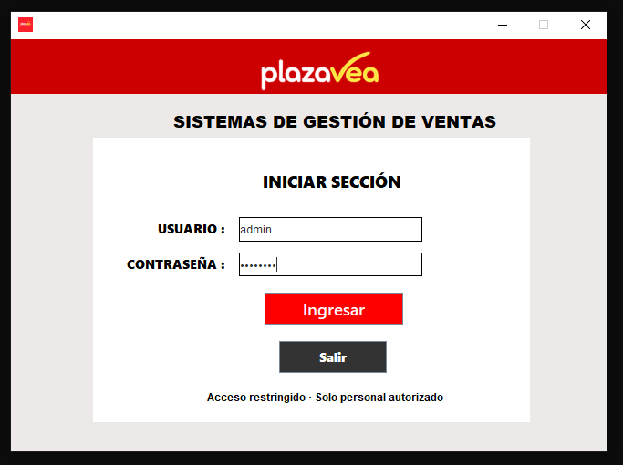
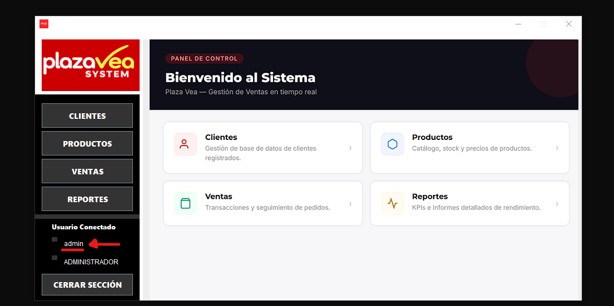
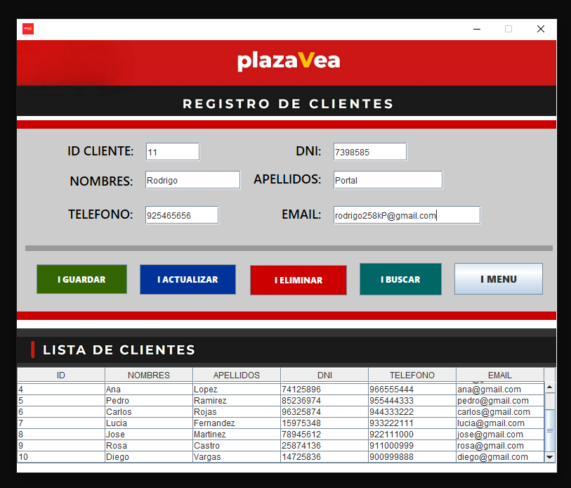
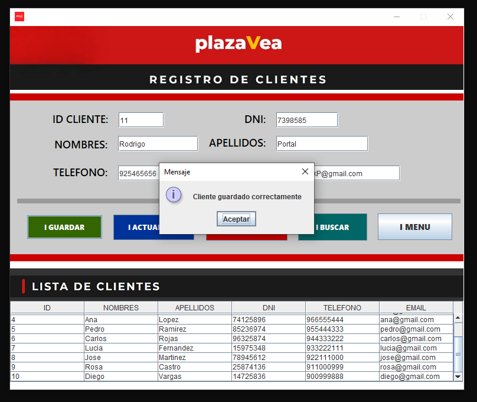
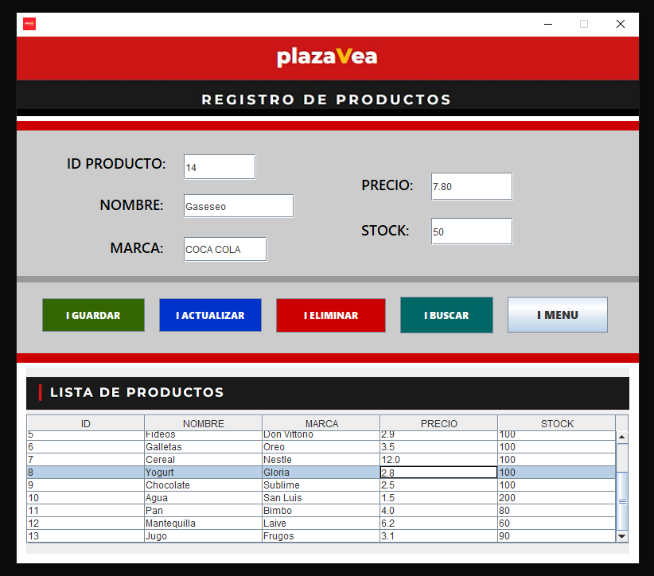
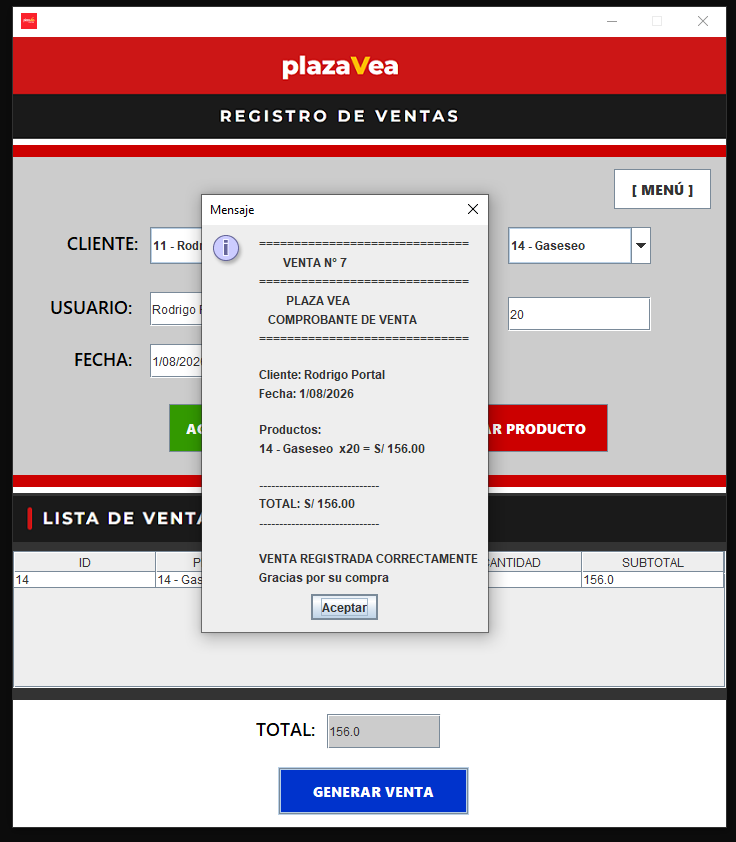
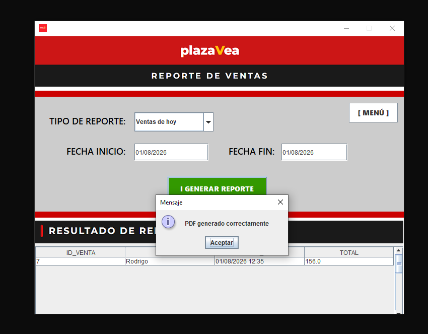
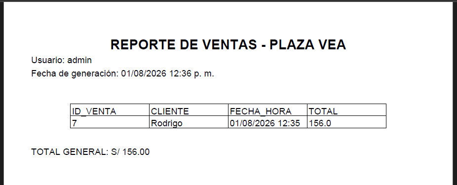

# 🛒 Sistema de Gestión de Ventas - PlazaVea

Sistema de Gestión de Ventas desarrollado en **Java Swing** que permite administrar clientes, productos y ventas mediante una interfaz gráfica intuitiva. El sistema se conecta a una base de datos **Oracle Database** utilizando **JDBC**, permitiendo registrar operaciones comerciales, administrar información y generar reportes de ventas en formato PDF.

Este proyecto fue desarrollado con fines académicos para fortalecer conocimientos en programación orientada a objetos, acceso a bases de datos, arquitectura por capas y desarrollo de aplicaciones de escritorio.

---

# ✨ Características principales

- 🔐 Inicio de sesión de usuarios.
- 👥 Gestión de clientes (Registrar, Buscar, Editar y Eliminar).
- 📦 Gestión completa de productos.
- 🛒 Registro de ventas.
- 💰 Cálculo automático del total de compra.
- 📊 Consulta de reportes de ventas.
- 📄 Exportación de reportes en formato PDF.
- 🗄️ Integración con Oracle Database mediante JDBC.
- 🖥️ Interfaz gráfica desarrollada con Java Swing.

---

# 🚀 Tecnologías utilizadas

| Tecnología | Descripción |
|------------|-------------|
| Java | Lenguaje principal |
| Java Swing | Interfaz gráfica |
| JDBC | Conexión con la base de datos |
| Oracle Database | Base de datos |
| Oracle SQL Developer | Administración de la base de datos |
| Oracle SQL Developer Data Modeler | Diseño del modelo de datos |
| NetBeans IDE | Entorno de desarrollo |
| iText PDF | Generación de reportes PDF |
| Git | Control de versiones |
| GitHub | Repositorio del proyecto |

---

# 📷 Capturas del sistema

## 🔐 Inicio de sesión

Autenticación de usuarios para acceder al sistema.



---

## 🏠 Panel principal

Pantalla principal desde donde se administran todos los módulos del sistema.



---

## 👥 Gestión de clientes

Permite registrar, buscar, modificar y eliminar clientes.



---

## ✅ Registro exitoso de cliente

Confirmación del registro de un nuevo cliente.



---

## 📦 Gestión de productos

Administración del catálogo de productos y control de inventario.



---

## 🛒 Registro de ventas

Permite seleccionar clientes, agregar productos y generar ventas.



---

## 📊 Reporte de ventas

Consulta de ventas mediante filtros por fecha.



---

## 📄 Reporte PDF

Reporte de ventas generado automáticamente en formato PDF.



---

# 📂 Estructura del proyecto

```
Sistema-Gestion-PlazaVea
│
├── Img/
├── lib/
├── nbproject/
├── src/
│   ├── config/
│   ├── dao/
│   ├── img/
│   ├── model/
│   └── view/
├── PlazaVea.sql
├── README.md
├── build.xml
└── manifest.mf
```

---

# ⚙️ Requisitos

- Java JDK 17 o superior
- NetBeans IDE
- Oracle Database
- Oracle SQL Developer

---

# ▶️ Instalación y ejecución

1. Clonar el repositorio.

```bash
git clone https://github.com/CristhianE-GuinoQ/Sistema-Gestion-PlazaVea.git
```

2. Abrir el proyecto en NetBeans.

3. Importar la base de datos utilizando el archivo:

```
PlazaVea.sql
```

4. Configurar los datos de conexión en:

```
src/plazavea/config/ConexionOracle.java
```

5. Ejecutar la clase principal:

```
Main.java
```

---

# 📚 Arquitectura del proyecto

El sistema sigue una estructura organizada por capas:

- **Model:** Entidades del sistema.
- **DAO:** Acceso a datos mediante JDBC.
- **View:** Interfaces gráficas desarrolladas con Java Swing.
- **Config:** Configuración de la conexión con Oracle Database.

---

# 🎯 Objetivos del proyecto

- Aplicar Programación Orientada a Objetos.
- Implementar operaciones CRUD.
- Conectar aplicaciones Java con Oracle Database mediante JDBC.
- Generar reportes PDF utilizando iText.
- Desarrollar una aplicación de escritorio con Java Swing.
- Aplicar buenas prácticas de organización del código.

---

# 👨‍💻 Autor

**Cristhian Enrique Guiño Quispe**

🎓 Estudiante de Ingeniería de Software con Inteligencia Artificial – SENATI

🔗 GitHub:
https://github.com/CristhianE-GuinoQ

---

# 📄 Licencia

Este proyecto fue desarrollado con fines académicos y de aprendizaje. Su código puede utilizarse como referencia educativa.
